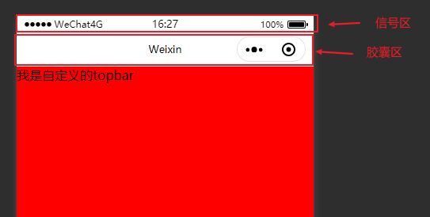
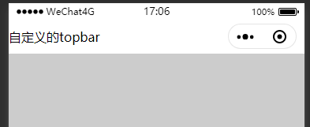
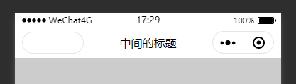

# 自定义小程序的顶部导航
> 小程序官方的topbar可能无法满足业务需求，下面介绍如何封装一个自定义的顶部栏


## 在首页的`page.json`中将官方导航关掉 并引入我们自定义的topbar 组件
> 也可以在全局关闭，看自己的需求

```json
// /pages/index/index.json
{
  "usingComponents": {
    "base-top-bar":"/components/base-top-bar/base-top-bar"
  },
  "navigationStyle":"custom"
}
```
## 获取信号区高度
- 
- 已知胶囊区的高度区是44px 
- 不同机型的信号区高度不同，我们需要动态的去改变，信号区高度通过小程序提供的api来获得
```js
ready(){
  /* 
  在组件的生命周期函数内 获取信号区的高度 这一步也可以在app.js里面获取,来减少资源浪费
  */

  // 获取设备的信息  
  let systemInfo = wx.getSystemInfoSync()
  // 获取信号区高度
  let statusBarHeight = systemInfo['statusBarHeight']

  /* 
  根据我的测验，实际的信号区高度在真机上表现与于实际的不服，所以我们这里还需要根据不同的设备进行调整
  开发工具 = 获取的高度
  安卓真机 = 获取的高度 + 1
  苹果真机 = 获取的高度 - 1
  我本人这里也只测试了iPhonex 华为和小米手机，
  如果有出入根据实际情况进行调整就行了
  */

  if (systemInfo.platform === 'andorid' ) {
    statusBarHeight = statusBarHeight+1
  }else if (systemInfo.platform === 'ios') {
    statusBarHeight = statusBarHeight-2
  }else{
    statusBarHeight = statusBarHeight
  }
  this.setData({
    statusBarHeight
  })

},
```
- wxml部分

```html
<view class="top-bar">
  <!-- 信号区 -->
  <view  style="height:{{statusBarHeight}}px;">
  </view>
  <!-- 胶囊区 -->
  <view  class="capsule-box">
    自定义的topbar
  </view>
</view>
```

- wxss

```css
.top-bar {
  background-color: #fff;
}

.capsule-box {
  height: 44px;
  display: flex;
  align-items: center;
}

```
- 效果<br>


## 后续改造
:::tip
> 到上面为止，其实我们已经基本做完了这个组件最核心的部分
> 但一款功能强大的组件还远不止于此

- 如何自定义页面返回键
> 因为页面场景不同我们可以通过小程序的api`getCurrentPages()`来获得当前路由的信息，来决定上一个页面是否存在，是否为switchtab的页面来对应不同的路由api，甚至可以类似原生那样显示不同的图标来获得更好的体验
- 微信胶囊参数?
> 微信胶囊 宽87px 高31px 右边距10px 如果 然后再44px的胶囊区对其进行垂直居中则可以形成左右对称而达到美观的效果<br>
> 

:::
### [代码片段](https://developers.weixin.qq.com/s/4UIaD4m37NmW)
> 最后自定义组件的魅力在于它足够灵活，所以的功能都需要你后面自己去开发完事


