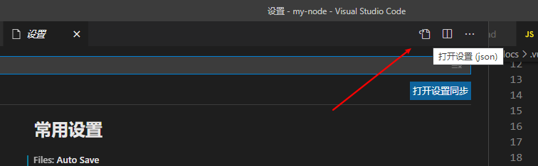

# vscode的插件推荐

## 前言
::: tip
- vscode之所以强大，受大多数人喜欢，一方面是它足够强，另一方面就是它的插件非常骚
- 下面我会对我所用过的觉得不错的插件进行整理，从实用性，美观性，针对性，风骚性来像大家展示各类的插件
:::

## 前端篇

### Live Server
::: tip
live server 启动后会在当前的目录运行一个本地服务器，当你的页面更改时，会实时的对页面进行热更新
- 
:::

### open in browser

::: tip
这个插件和上面的插件功能类似，安装后在`.html`右键后就会出现`open in browser`的选项，跟上面的插件相比，运用于调试不那么频繁的项目或者写一些小demo
:::

### easy sass 和 easy less
::: tip
如果你也和我一样，喜欢使用sass和less那么这两个插件也是必装的了，当你按下`ctrl+s`时，会自动的在目录中生成一个`.css`后缀的同名文件，这两个插件支持配置，可以运用于更多的场景
:::
#### easy sass 的配置

```json
{
 "easysass.formats": [

    {
      "format": "expanded",
      // format 的合法值
      //nested：嵌套缩进的 css 代码。
      //expanded：没有缩进的、扩展的css代码。
      //compact：简洁格式的 css 代码。
      //compressed：压缩后的 css 代码
      "extension": ".css" //设置编译输出的文件名
    },
    {
        "format": "compressed",
        "extension": ".min.css" //设置编译输出的文件名
    },
  ],
  "easysass.targetDir": "./css/" //提供 css 输出路径的设置（可以是绝对路径或者相对路径） 可以选填，如果不配置则默认是同路径之下
}

```
#### easy less 的配置
```json

"less.compile": {
    "out": "../css/app.css", //定义好输出的文件路径
    "autoprefixer": "> 5%, last 2 Chrome versions, not ie 6-9", // 暂时不知道有什么用
    "compress": true, // 是否删除多余空白字符  打开相当于压缩
    "sourceMap": false, // 是否创建文件目录树，true的话会自动生成一个 .css.map 文件
    "outExt": ".wxss", // 输出文件的后缀,默认为.css
  }

```

::: tip
可以选择在全局或者只在工作区配置，关于配置的具体操作，如果不了解的，会在下面进行统一的说明
:::

### Auto Rename Tag
::: tip
**`Auto Rename Tag`** 在你更改标签时，会自动的去更改闭合标签的内容
- 
:::

### Auto Close Tag
::: tip
**`Auto Close Tag`** 会自动的生成一个闭合标签,在运用于自定义组件时是个不错的选择
- 
:::

### JavaScript (ES6) code snippets

::: tip
这款个插件提供了一些es6内置的代码快，是否安装看个人喜好
:::

### Vetur

::: tip
如果你时一个vue的开发者，或者对vue感兴趣，那姆 **`Vetur`** 属于必装插件。里面提供了vue的语法高亮、代码快、格式整理等等功能，让你的vue开发变得无比丝滑，没有它我甚至都不会写vue了
:::

### ESLint
::: tip
**`ESLint`**可以检查你的js代码是否书写规范，第一是因为它足够有名，第二则是它的功能确实强大，要开启它的完全体模式需要阅读官方文档的配置，可以使你的代码格式更加符合你自己的习惯
> 比如是否以分号结尾
:::

### 小程序插件合集
::: tip
1. 小程序开发助手
2. minapp
3. vscode wxml
4. 小程序助手
5. wxml
> 以上插件都可以只在小程序的单独工作区为其打开，作为小程序开发者，VScode对其也有强大的支持性，个人认为开发体验胜过于微信开发工具
:::

## 通用篇
::: tip
通用篇介绍的往往是一些工具类的插件，往往运用的范围更为广泛，依赖度也更高
:::

### Prettier
::: tip
Prettier整合了许多语言的代码格式整理，属于必装插件
- **代码整理的插件建议只安装一个，我个人偏向于这款，`Beautify` 也是不错的选择之一，完全看个人喜好**
:::

### Bracket Pair Colorizer

::: tip
- **`Bracket Pair Colorizer`** 可以让你代码中的括号，非对组的颜色变得不同，让代码变得更有辨识度，某种意义上说也使得代码也变得更加美观优雅
- 
:::

### Path Intellisense
::: tip
**`Path Intellisense`** 的作用在于，当你在输入`/` 或者 `./` 时，会自动的在项目目录或者当前的相对路径匹配文件名，对于使用vscode来说，这个插件属于必装插件
:::

### Draw.io Integration
::: tip
**`Draw.io Integration`** 可以在vscode中绘制流程图，可以满足绝大多数的需求，可能对比专业的流程图软件操作不是那么丝滑，主要就是为了装b。
:::

### koroFileHeader
::: tip
**`koroFileHeader`**会自动在文件的头部生成注释，记录如 **文件生成日期、最后编辑时间、描述**等信息，这个是否使用时看个人的，它本身也支持很多的配置实现更灵活的运用
- 
:::


### Colorful Comments

::: tip
**`Colorful Comments`** 可以更换你注释的高亮色，让代码可读性变高
-

:::


### vscode-icons

::: tip
这个插件也是我个人认为最值得安装的插件之一，一款编辑器好不好用，很大程度在于它好不好看，一款好看的编辑器，可以让我们写代码时变得更加舒心，这款插件会格局你文件的后缀和文件夹名称，改变文件图标的显示，增强目录的可读性和风格

-
:::

### GitLens 
::: tip
GitLens 也是vscode中大名鼎鼎的插件，可以查看git中历史的版本
- 
:::

### Markdown All in One 和 Markdown Preview Enhanced
::: tip
如果你喜欢使用vscode编写markdown文档，那么以上两款插件也是里面的不三选择
- 第一款可以让vscode编辑器对markdown文档有全方面的支持，包括但不限于内置代码块、快捷键、代码整理，总之装上就对了，好东西我们从不嫌多
- 第二款可以在编辑器旁边打开一个实时预览的界面
- 
:::


### 关于编辑器的风格
::: tip
插件中提供了海量的皮肤可供选择，在插件中搜索`category:themes`,可以看到很多不乏百万级别下载量的皮肤，很多皮肤具有强烈的风格满足特殊的喜好
- 例如这一款`Winter is Coming Theme` 的皮肤，作为一个冰火粉丝来说，难以抵抗

:::


## 摸鱼篇

::: tip
一个不会摸鱼的程序员，不是一个号程序员，敲代码之余，一点要学会适当的娱乐来保证身心健康，而如何摸鱼而不被老板发现，在同事面前装逼，显得尤为关键，请容许我向大家推荐以下几款插件，打开vscode的隐藏功能
:::

### 小霸王
::: tip
拥有小霸王我们就实现了在vscode玩小霸王的能力，游戏好不好玩不关键，怎么玩，怎么装逼很关键
- 安装后在左侧菜单找到小霸王的选项，在`remote`中右键下载，等待下载完毕就可以开启游戏之旅了
:::

### Zhihu On VSCode
::: tip
如何刷知乎又看起来像是在工作？这款插件就可以做到，里面实现了日常逛知乎的绝大多数功能
:::

### 掘金
::: tip
是的你没看错，插件名字就叫`掘金`，有时候我真的不得不佩服那些大佬，总是又独特的思路，安装这个插件之后，就可以在vscode中刷掘金了，具体使用可以看插件介绍
:::


## 关于插件的配置
::: tip
1. 点击左下角配置图标->选择设置
2. 在设置界面的右上角会发现一个打开设置的图标，点击后会打开一个`settings.json`的文件。在此文件内，将设置的内容写入即可完成配置，部分插件的设置在写入后需要重启才会生效

1. 设置分为两种 `用户区`代表全局配置，`工作区`则只在当前编辑器打开的目录生效,当你更改工作区的配置后，在项目的根目录就会出现`.vscode`的文件夹保存着你的配置，`工作区`的权级大于用户区`用户区`
:::