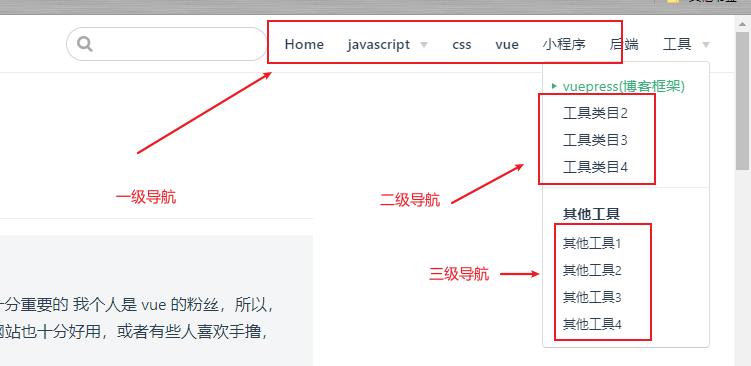

# vuePress的使用笔记

## 前言

::: tip 为什么要使用 vuepress
博客的作为文档的输出工具，选择一款合适的框架，是十分重要的
我个人是 vue 的粉丝，所以，选择`vuepress`也是当仁不让
当然也有一些其他的博客网站也十分好用，或者有些人喜欢手撸，这当然都是可以的。
[参考文档](https://coder.itclan.cn/fontend/tools/vuepress-build-blog/)
:::

## 依赖

1. 最新的 node 版本
2. 有一定的 md 书写经验
3. 有 node 的使用经验

## 安装

```
# 1. 初始化
npm init -y
# 2. 安装vuepress
# 全局安装
npm install -g vuepress
# 局部安装
npm install  vuepress

```

> 在 pack.json 内加入以下配置

```json
"scripts": {
  "dev": "vuepress dev docs",
  "build": "vuepress build docs"
}
```

## 目录结构初始

1. 新建文件夹`./docs`

> 存放我们写的博客

2. 新建文件夹 `./docs/.vuepress`

> 存放静态资源和配置

3. 新建文件 `./docs/.vuepress/config.js`

> 主要的入口配置文件

4. 新建文件 `./docs/readme.md`

> 首页

5. 在 config.js 内输入以下的内容

```js
module.exports = {
  title: "name网站",
  description: "name的网站,专注前端技术栈分享",
};
```

6. 在`./docs/readme.md`增加以下内容

```md
---
home: true
heroImage: /images/itclancoder.jpeg
heroText: itclanCoder
tagline: 书以启智,技于谋生,活出斜杠
actionText: 开始阅读 →
actionLink: /latestarticle/
features:
  - title: 读书
    details: 随笔川迹,文以载道,虚心学习,自省自知,多读一页书,就少一分无知,多一分智慧
  - title: 技术
    details: 用心记录技术,走心分享,始于前端,不止于前端,励志成为一名优秀的全栈工程师,真正的实现码中致富
  - title: 生活
    details: 无分享,不生活,一个具有情怀的技匠,路上正追逐斜杠青年的践行者
  - title: 生活
    details: 无分享,不生活,一个具有情怀的技匠,路上正追逐斜杠青年的践行者
footer: MIT Licensed | Copyright © 2020-present 随笔川迹
---
```

::: tip 提醒
在第 6 点的配置中，存在一个图片路径，实际上我们并没有这个路径
可以新建文件夹 `/docs/.vuepress/public/images/`,将图片放进去,
这个文件主要存放公共资源
:::

7. 输入`npm run dev` 启动

## 配置

::: tip 关于配置
- 配置的 [官方文档](https://v0.vuepress.vuejs.org/zh/config/)
- 一旦更改配置后，都要重新运行项目才会得到更新
:::

### 配置文件的拆分

:::tip 分模块配置

- 由于`config.js`配置的内容过多，所以建议使用模块导出的方式分别将配置文件放在不同的 js 文件中方便之后管理维护。
- 所以以下我会新建一个文件夹专门存放配置的子目录`/docs/.vuepress/confing/`

```js
// 在nav.js
const nav = {};
module.exports = nav;
```

```js
// 在config.js
const nav = require("./config/nav");
module.exports = {
  title: "kw的博客网站",
  description: "kw的博客网站,专注前端技术栈分享",
  themeConfig: {
    logo: "/images/logo.png",
    nav, // nav为导入内容
  },
};

```

- 之后其他的配置文件，如果必要都会采用这种方式不再赘述，至于名字或者目录接口可以看个人的喜好，当然写在一个 js 内也是完全可以的
  :::

### 配置顶部导航

::: tip 顶部导航级数
vuepress 导航分为`一级导航` 、`二级导航`和`三级导航`
- 一级导航是顶部导航栏横幅那条
- 当二级导航配置后,悬浮一级导航时,会出现下列菜单,这里面就是配置的二级导航
- 当三级导航配置时,下列菜单的二级导航会变为粗体,而三级导航会出现在下方变为二级导航的子条目
- 具目前来看，不太可能有4级导航，大多数人也不太需要


:::

#### 顶部导航的log
```js
// .vuepress/config.js
module.exports = {
  themeConfig: {
    logo: '/assets/img/logo.png',
  }
}
```
#### 顶部导航一级导航
```js
// .vuepress/config.js
module.exports = {
  themeConfig: {
    nav: [
      { text: 'Home', link: '/' },
      { text: '前端', link: '/front/' },
      { text: '后端', link: '/server/' },
    ]
  }
}
```
::: tip 关于配置的字段 
- text 是描述的文字，
- link是路径,可以是相对路径或者网路链接
- 路径如果没有指定具体的文件，会自动寻找文件夹下的`index.md` 或者 `readme.md` ,也可以指定具体的文件名，来增加文件的辨识度
:::
#### 配置2、3级导航
::: tip 关于2、3级导航 
- 2、3级导航的配置方法完全和一级导航类似
- 如果你需要2级导航，就在对象中增加一个`items`的数组就行了,三级也是一样, 代码如下
```js
// .vuepress/config/nav.js
const nav =  [
  {
    text: 'vue',
    link: '/vue/',
  },
  {
    text: 'javascript',
    link: '/js/',
    items:[
      {
        text: 'es6',
        link: '/js/es6.md',
      },
      {
        text: 'js中的数组方法',
        link: '/js/arr-function.md',
      },
    ]
  },
  {
    text: 'css',
    link: '/css/',
  },
]
```
- 如果你的博客还不多，建议先使用一级导航，然后再使用二级导航，三级导航其实都很少用到
- 当你配置了`items`字段后，`link`属性就不再生效了
:::


### 配置侧边栏

:::tip tip
- vuepress默认是没有侧边栏的
- 我们可以通过配置开启侧边栏
- 侧边栏有自动或手动两种方式
- 自动侧边栏会查找md文件中的h2和h3标签，最大的深度为2

:::

#### 设置所有文件自动侧边栏
```js
// .vuepress\config.js
module.exports = {
  themeConfig: {
    sidebar:'auto',
  }
}
```
::: warning
如果是这样的话，配置可能就不够灵活
- 可以在需要自动生成侧边栏的页面加入以下配置，灵活的配置
```yaml
---
sidebar: auto
---
```
:::

#### 侧边栏分组
